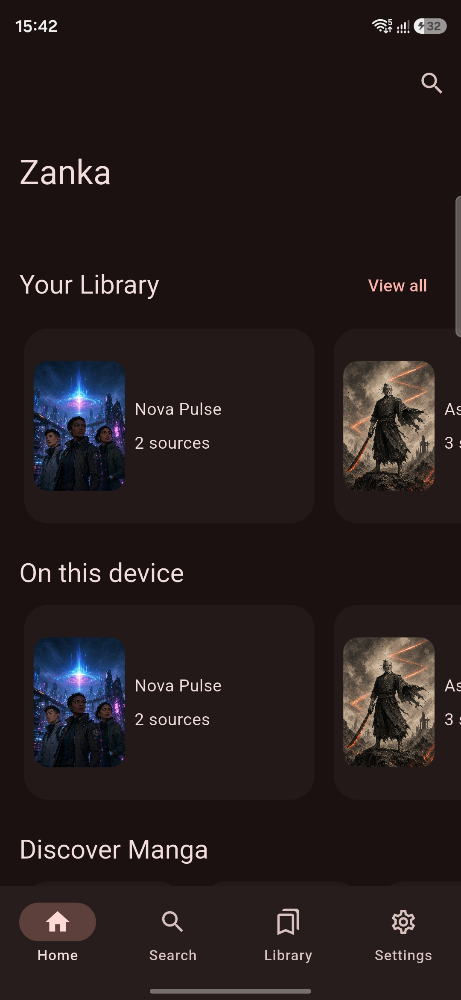
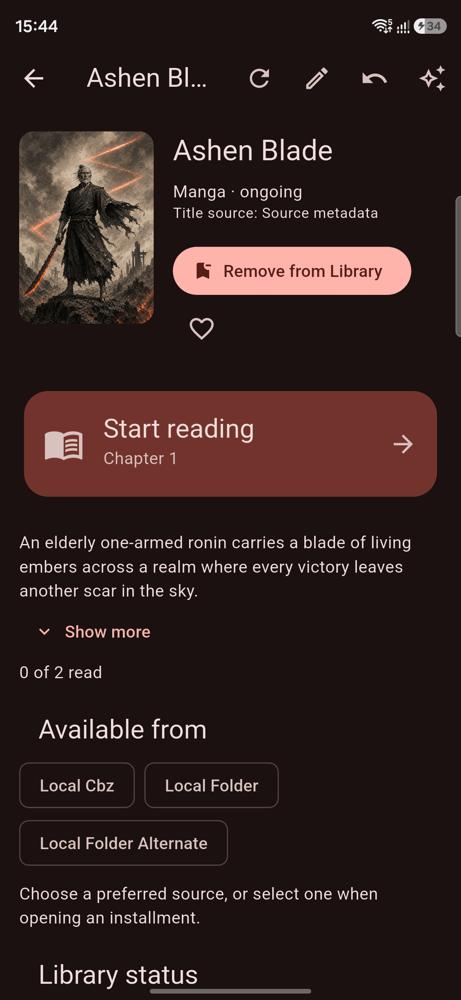
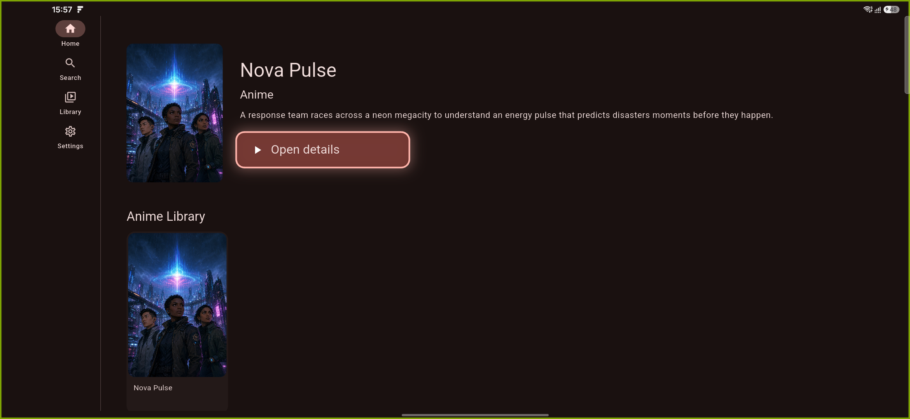
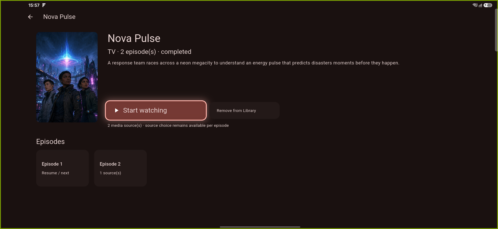

# Zanka no Tachi

A source-agnostic manga reader and anime streaming app for Android phones,
tablets, and TVs.

**Android Mobile · Android TV · Google TV · Fire TV**

Zanka keeps your library and progress attached to canonical media—not to a
provider URL or provider-local ID. Read lawful local manga, play local video,
or use compatible public sources without making the product UI provider-aware.

[Download the production-signed beta](https://github.com/PurpleLemon73/zanka-no-tachi/releases/tag/v0.2.0-beta.4)
or [build it yourself](#build-from-source). One adaptive APK selects the mobile
or 10-foot TV experience from Android's semantic device capabilities.

The source tree is preparing **1.0.0-rc.1 (build 6)** for maintainer testing, not
a published stable 1.0 release. The link above remains the last published beta.
See the [RC.1 preparation and validation handoff](docs/release/v1.0.0-rc.1.md).

## See it in action

| Mobile Home | Manga details |
| --- | --- |
|  |  |

| TV Home | TV anime details |
| --- | --- |
|  |  |

> All screenshots and showcase media use original demo assets created
> specifically for Zanka. Ashen Blade and Nova Pulse are fictional showcase
> titles, not provider titles.

## Highlights

- A normal Home, Search, Library, and compact media Details experience
- Canonical manga/anime identity with multiple interchangeable source bindings
- Smart Start, Resume, Next, and Completed actions shared across Home/Details
- Exact source-specific page or timestamp resume, separate from completion
- Local folder/CBZ manga and local video import, repair, removal, and backup
- Live MangaWorld reading and AnimeWorld playback when ordinary public media is
  available; per-installment capability is reported truthfully
- Manga Reader UI v2 with Previous/Next Chapter, completion actions, a lazy
  chapter picker, truthful volume navigation, zoom/pan, and read/unread controls
- Player UI v2 with previous/next episode, Replay, episode picker, timeline,
  ±10-second seek, watched/autoplay, remote controls, and lifecycle resume
- Live Video Display Mode controls with independent fit and aspect selection,
  presets, custom ratios, and a safe Auto / Original default
- Material 3 System/Light/Dark themes with a persisted accent color
- Remote-first Android TV / Google TV / Fire TV shell with visible D-pad focus

Zanka does not implement authentication, CAPTCHA or anti-bot bypasses, DRM or
access-control circumvention, protected-content extraction, or automatic domain
discovery. Metadata-only sources remain metadata-only.

## Install

The beta APK is side-loaded; it is not currently distributed through an app
store. Download `zanka-no-tachi-v0.2.0-beta.4.apk` from Releases, verify the
published SHA-256 checksum, then install it:

```bash
adb install -r zanka-no-tachi-v0.2.0-beta.4.apk
```

On a phone or tablet, open Zanka from the launcher and follow onboarding. On
Android TV / Google TV / Fire TV, send the same APK with ADB or a trusted
sideloading tool, then open Zanka from Apps. See the complete
[mobile and TV installation guide](docs/release/INSTALLING.md).

This beta artifact's signing status is stated on its GitHub Release. Never
install an APK whose checksum or signer differs unexpectedly.

## Phone and tablet

Home surfaces your canonical library and Smart Resume actions. Search is
bounded and user-driven. Details combines every source for one title, while
Reader/Player choose only bindings that can actually provide media. Settings
contains local imports, backups, appearance, and maintenance. Diagnostic and
experimental tools are available only in development builds.

## TV and remote

The TV shell uses a hero and horizontal rails, dedicated landscape anime
Details, remote-first Search/Library, and player controls that can be summoned
without touch.

| Remote input | Action |
| --- | --- |
| D-pad | Navigate |
| OK / Select | Activate or play/pause |
| Left / Right | Navigate player controls; reveal and seek when the overlay is hidden |
| Play / Pause | Playback |
| Back | Hide controls or go back |

Android TV and Google TV have emulator validation. The maintainer confirmed
startup and primary flows on a Samsung phone and Fire TV Stick using the
corrected pre-RC production APK. RC.1 itself still needs physical validation;
this is not blanket Fire certification. Core Fire OS use requires no Google
Play Services.

## Sources and local media

MangaWorld and AnimeWorld adapters expose public catalog metadata and only
promote reader/playback capability when a public delivery path is verified.
Provider availability can change or drift. Zanka distinguishes network errors,
parser drift, unsupported delivery, and expired media; a failed source can be
retried or switched without losing canonical progress.

Your own folders, CBZ archives, and video files use the same source-binding
architecture. Physical paths are never canonical identity. Missing files remain
repairable, and portable backups intentionally exclude media bytes and absolute
paths.

## Release candidate status

`v0.2.0-beta.4` remains the published Android beta; `1.0.0-rc.1+6` is the current
candidate, not stable 1.0. Production-signed beta.2 and later installations
update in place with the same package and permanent certificate; do not clear
their data. Legacy debug-signed beta.1 has a separate
[signing migration](docs/release/BETA1_TO_BETA2_MIGRATION.md).

Production bundles no demo assets or Developer UI and selects only
`video_player`; Better Player's native dependencies remain packaged but its
experimental playback selection is development-only. Database schema 6 and
data-only backup format 3 are unchanged for RC.1. Expect provider markup/delivery
changes and unsupported live installments. There is no cloud sync, background
playback, TV recommendations/channels, or TV-specific manga reader.

## Architecture

`CanonicalMedia` owns identity and user state. Provider IDs and locators live in
source bindings. UI calls application repositories; HTTP/parsing and local
payload resolution stay behind adapter, reader, and player contracts. Refresh
is idempotent and preserves library/progress.

Start with the [documentation index](docs/README.md),
[domain model](docs/architecture/DOMAIN_MODEL.md),
[adapter platform](docs/architecture/ADAPTER_PLATFORM.md), and
[release hardening](docs/release/RELEASE_HARDENING.md).

## An AI-development experiment

Zanka is a personal experiment in autonomous software development: an extended
Ralph-style workflow with OpenAI Codex building a fully AI-coded manga reader
and anime streaming app from scratch. The public repository contains the
product, tests, and durable technical documentation—not its private internal
prompt/process archive.

## Build from source

Use Flutter 3.47.2, full JDK 21 (CI uses Temurin), and the existing Android SDK.
Select your local JDK using `ZANKA_JAVA_HOME` or `JAVA_HOME`; the
[build wrapper](docs/features/BUILD_PROFILES.md#jdk-21-selection) verifies and pins
it without changing global Flutter settings:

```bash
flutter pub get
dart format --output=none --set-exit-if-changed .
flutter analyze
flutter test --flavor development
flutter test --flavor production test/app/build_profile_test.dart
tool/with_android_jdk.sh flutter build apk --debug --flavor development
tool/with_android_jdk.sh flutter build apk --debug --flavor production
```

Run with `tool/with_android_jdk.sh flutter run --flavor development`.
For the clean production product, use
`tool/with_android_jdk.sh flutter build apk --release --flavor production`; signing is maintainer-owned
and has no debug-key fallback. See [Build profiles](docs/features/BUILD_PROFILES.md)
and [Releasing](docs/release/RELEASING.md).

## Privacy, independence, and contributing

Development diagnostics are local, bounded, and redacted; production exposes no
diagnostic UI or app-owned diagnostic recorder. Zanka has no project-operated
account or analytics service. Read [PRIVACY.md](PRIVACY.md) for exact behavior.

Zanka no Tachi is an independent, unofficial open-source project. It is not
affiliated with, endorsed by, or sponsored by publishers, studios, creators,
franchise rights holders, or configured content providers. The software and
this repository grant no rights to third-party content.

Contributions are welcome under [CONTRIBUTING.md](CONTRIBUTING.md). Project
source is available under the [MIT License](LICENSE).
